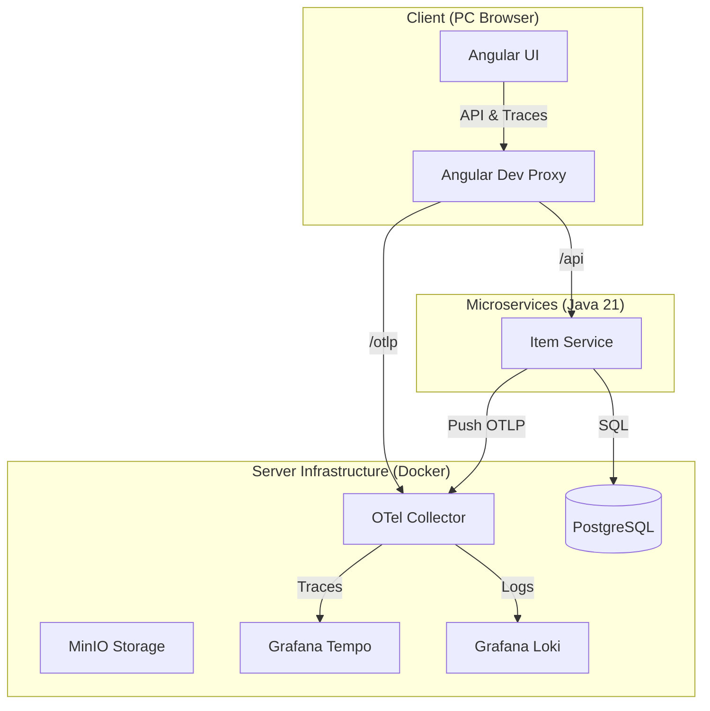

# 🏠 Home Inventory System (家庭庫存管理系統)


這是一個現代化的微服務展示專案，旨在演示如何建構一個具備 **全鏈路可觀測性**、**無痕配置管理** 與 **高解耦架構** 的應用系統。

## 🌟 亮點功能

- **全鏈路分散式追蹤 (End-to-End Tracing)**: 追蹤請求從瀏覽器點擊，經過開發代理，穿過 Java 服務，最終到達資料庫的完整路徑。
- **單一配置來源 (.env Single Source of Truth)**: 全系統（Java, Angular, Docker）共享根目錄 `.env` 檔案，實現零重複配置。
- **遠端開發優化**: 專為 PC 連接 Server 的開發環境設計，透過 Angular Proxy 實現無感連線與 IP 隱藏。
- **現代化技術棧**: 採用最新的 Angular 21 (Standalone) 與 Spring Boot 4.0.1。

## 🛰️ 系統架構



## 🗺️ 開發規劃
請參閱我們的 [Detailed Roadmap](./ROADMAP.md) 了解 Phase 1 至 Phase 4 的演進計畫。

## 🚀 快速開始

### 1. 環境準備
- **配置環境變數**:
  ```bash
  cp .env.example .env
  ```
  *(編輯 `.env` 填入你的開發伺服器 IP 於 `BACKEND_HOST` 與 `ALLOWED_HOSTS`)*

- **啟動基礎設施 (Docker)**:
  ```bash
  docker compose up -d
  ```

### 2. 啟動後端
進入 `backend/backend-java`，執行：
```bash
./gradlew :item-service:bootRun
```

### 3. 啟動前端
進入 `frontend/inventory-ui`，執行：
```bash
npm install
npm start
```

## 🛠️ 技術堆疊 (Tech Stack)

### Backend & Core
- **Language:** Java 21 (LTS)
- **Framework:** Spring Boot 4.0.1
- **Observability:** OpenTelemetry (Micrometer Tracing)
- **API Docs:** Swagger / OpenAPI 3 (SpringDoc)

### Frontend
- **Framework:** Angular 21 (Standalone Components)
- **Observability:** OpenTelemetry Web SDK (v2.x)
- **Styles:** Bootstrap 5 & Bootstrap Icons

### Infrastructure (The "LGTM" Stack)
- **Tracer:** Grafana Tempo
- **Logs:** Grafana Loki (via OTel Collector)
- **Metrics:** Prometheus
- **Visualization:** Grafana
- **Storage & MQ:** PostgreSQL 15, MinIO, RabbitMQ

## 📂 專案目錄結構
- `backend/`: 基於 Java 21 的微服務模組（預設 Port: `8080`）。
- `frontend/`: 基於 Angular 21 的響應式介面（預設 Port: `4200`）。
- `infra/`: OTel, Grafana, Loki 等基礎設施配置。
- `modify_history/`: 專案演進的技術決策紀錄。

## 📜 License
MIT License