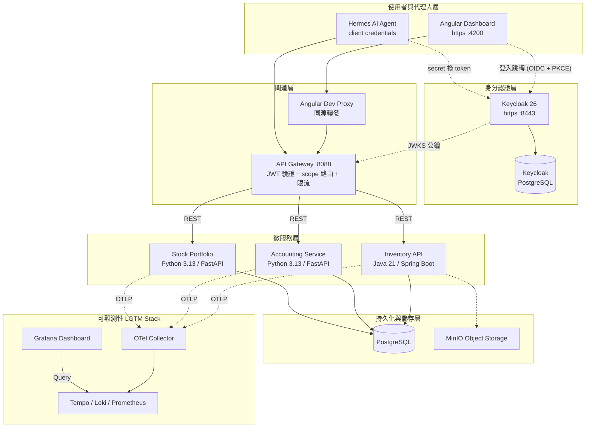

# 🏠 Home Service Hub (家庭服務中樞)

這是一個現代化的 **個人生活運算中樞**。系統從最初的個人工具演進為**由 AI Agent 驅動的自動化後端**。它展示了如何結合 **AI Agent 調用**、**全鏈路可觀測性** 與 **多語言微服務** 來構建一個穩健的家庭自動化系統。

## 🏗 系統架構 (Architecture)

### 認證與閘道的分工

- **Keycloak（身分認證）**：唯一知道「你是誰」的元件。瀏覽器走 OIDC 授權碼流程（帳密 + 30/90 天 remember-me session）；機器（Hermes agent）走 client credentials（clientID + secret）。兩者拿到的都是 Keycloak 私鑰簽名的短效 JWT（300 秒），token 內含 scope（如 `accounting.read`）。
- **API Gateway（存取控制）**：所有 API 請求的單一入口。用 Keycloak 的 JWKS 公鑰離線驗證 token 簽名、時效與 audience，並依路由檢查 scope（例如 Hermes 的 token 只有 `accounting.*`，打 `/api/items` 會被 403），再加上 bucket4j 限流。驗證不回查 Keycloak，兩者執行期解耦。
- **後端服務**：內建 resource-server 驗證能力，由 `AUTH_ENFORCEMENT_ENABLED` 控制（目前為審計模式，gateway 是唯一強制點；可逐服務開啟形成雙層防禦）。

## 🌟 亮點功能 (Features)

- **🤖 AI Agent First**: 服務設計之初即考量 AI Agent的調用需求，具備良好的 API 結構與錯誤回傳機制。Hermes agent 以專屬 service account（最小權限 scope）透過閘道記帳。
- **🔐 統一認證與閘道**: Keycloak (OIDC) 簽發短效 JWT，Spring Cloud Gateway 集中驗證簽名/audience/scope 並限流；前端經 keycloak-js 登入（HTTPS + PKCE），支援長效 remember-me session。
- **全鏈路分散式追蹤 (End-to-End Tracing)**: 從 AI Agent 发起請求到資料庫回應，完整記錄每一毫秒的延遲與日誌。
- **結構化日誌 (Structured Logging)**: Python 服務以 `structlog` 輸出 JSON 日誌，無縫接入 Loki / Grafana。本地開發可切 `LOG_FORMAT=console` 改用人類可讀格式。
- **AI 驅動記帳系統**: 支援自然語言解析，自動將口語化描述轉化為精確的財務交易。
- **智慧庫存與投資**: 整合物件儲存 (MinIO) 管理實體物資，並自動抓取即時台股數據；台股組合支援 CSV 匯入、每日 OHLC 回填、除權息事件抓取、減資/分割自動調整成本基礎，以及當沖標記推導。
- **In-process Scheduler**: 台股組合服務內建 APScheduler，每日 17:00 回補 TWSE/TPEx 收盤、盤中每 15 分鐘刷新報價、15:30 寫入淨值快照。可透過 `SCHEDULER_ENABLED=false` 關閉。

## 🚀 快速開始 (Getting Started)

### 1. 環境準備
- **配置環境變數**: `cp .env.example .env`
- **啟動基礎設施**: `docker compose up -d`
- **選用 RabbitMQ**: RabbitMQ 預設不啟動；需要時執行 `docker compose --profile messaging up -d rabbitmq`

### 2. 啟動服務 (各服務目錄下執行)
- **Inventory**: `./gradlew :item-service:bootRun`
- **Accounting**: `uvicorn app.main:app --port 8000`
- **Stock**: `uvicorn app.main:app --port 8001`
- **Gateway**: `../inventory-api/gradlew -p . bootRun`（於 `services/gateway-service`）
- **Frontend**: `npm start`（HTTPS，入口 `https://<LAN-IP>:4200`）

或一次啟動全部：`npx pm2 start ecosystem.config.js`

> 認證相關：Keycloak 由 `docker compose up -d keycloak` 帶起（`https://<LAN-IP>:8443`，mkcert 憑證）。realm JSON 只在空 DB 時匯入，線上變更需透過 `kcadm`；詳見 [`docs/security/keycloak-operations.md`](docs/security/keycloak-operations.md)。

### 3. Stock Portfolio 服務環境變數
- `SCHEDULER_ENABLED` (預設 `true`)：設 `false` 停用內建 APScheduler（測試 / CI 必設）。
- `LOG_FORMAT` (預設 `json`)：設 `console` 切換為人類可讀格式。

服務細節（端點清單、Scheduler cron、Day-trade 推導規則等）見 [`services/stock-portfolio-service/README.md`](services/stock-portfolio-service/README.md)。

### 4. 本機安全預設

- Compose 發佈的基礎設施與後端服務預設只綁定 `127.0.0.1`。`INFRA_BIND_HOST` 控制 PostgreSQL、RabbitMQ、OTel、Tempo、Prometheus、Loki、Grafana 與 MinIO；`APP_BIND_HOST` 控制三個後端 API。除非已有明確的防火牆或 Gateway 規則，請勿改成 `0.0.0.0`。
- PM2 啟動的 Accounting、Stock backends 與 Gateway 都只綁定 `127.0.0.1`；Frontend（HTTPS）維持 VPN/LAN 可達，作為唯一瀏覽器入口，API 流量經其 proxy 進入 Gateway。Keycloak 綁定 LAN（`IDENTITY_BIND_HOST`），供瀏覽器登入跳轉使用。
- Inventory 在本機直接啟動時由 `INVENTORY_SERVER_ADDRESS` 控制監聽位址，預設 `127.0.0.1`。Compose 會在容器內覆寫為 `0.0.0.0`，但 host 端仍只發佈至 `APP_BIND_HOST`。
- Inventory 的 OpenAPI 與 Swagger UI 預設關閉。僅在受信任的除錯環境設 `INVENTORY_API_DOCS_ENABLED=true` 開啟。
- SQL query text、parameter values 與 query arguments 預設不進入觀測資料。除錯時可分別使用 `INVENTORY_SQL_QUERY_TEXT_ENABLED`、`INVENTORY_SQL_PARAMETER_VALUES_ENABLED`、`INVENTORY_SQL_QUERY_ARGUMENTS_ENABLED` 顯式開啟；Hibernate SQL logger 另由 `INVENTORY_HIBERNATE_SQL_LOG_LEVEL` 控制，預設 `OFF`。這些內容可能包含敏感資料。
- HTTP query string、request payload 與 Logbook 完整 request/response logging 預設關閉。僅在受信任的短期除錯環境分別使用 `INVENTORY_HTTP_QUERY_LOGGING_ENABLED=true`、`INVENTORY_HTTP_PAYLOAD_LOGGING_ENABLED=true` 或調高 `INVENTORY_LOGBOOK_LOG_LEVEL`；完成後應立即恢復安全預設。
- `MINIO_ENDPOINT=http://127.0.0.1:9000` 是 Inventory backend SDK 使用的內部端點；`MINIO_PUBLIC_ENDPOINT=/minio` 是瀏覽器使用的同源路徑，由 Frontend proxy 轉送至 loopback MinIO，因此不需要將 port 9000 開放至 LAN。
- `.env.example` 只提供 placeholder。請在未納入版本控制的 `.env` 中自行設定實際密碼；修改 template 不會輪替現有 PostgreSQL、Grafana、MinIO 或 RabbitMQ 帳密。

## 🗺 發展路線 (Roadmap)

### 🟡 Phase 1 & 2: 核心強化與認證 (Active)
- [x] **身分驗證整合**: 已串接 Keycloak（密碼 + 長效 remember-me session）。FIDO2/passkey 曾實作後棄用——WebAuthn RP ID 強制網域，會引入區網 DNS 單點依賴，對內網自用不划算。
- [ ] **後端強制驗證 cutover**: 逐服務開啟 `AUTH_ENFORCEMENT_ENABLED` 形成雙層防禦（gateway 目前為唯一強制點）。
- [ ] **Python 觀測性優化**: 完善 Python 服務的 Trace 欄位與 Context 傳遞。
- [ ] **後端精細化驗證**: 使用 `jakarta.validation` 確保 Java 端數據完整性。
- [ ] **MinIO 完整整合**: 實作圖片上傳、預簽名 URL (Presigned URLs) 與縮圖處理。

### 🟣 Phase 3: 異步架構與微服務解耦 (Planned)
- [ ] **RabbitMQ 整合**: 實作 Domain Events 驅動跨服務協作。
- [ ] **Audit Service**: 建立獨立的審計微服務，非同步記錄系統變動。

### 🔴 Phase 4: 效能優化與邊界安全 (Planned)
- [ ] **Redis Caching**: 為熱門查詢實作快取。
- [x] **API Gateway & Rate Limiting**: Spring Cloud Gateway 統一入口（JWT 驗證 + scope 路由 + bucket4j 限流）。

---
*Created and maintained as a personal digital life management suite.*

## 📄 授權 (License)

本專案採用 [MIT](LICENSE) 授權。您可以自由使用、修改與分發，但請保留原作者版權聲明。
