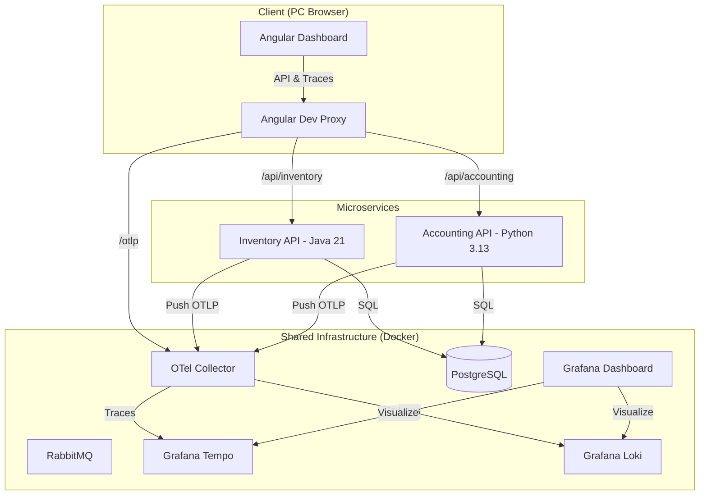

# 🏠 Home Service Hub (家庭服務中樞)


這是一個現代化的 **個人生活運算中樞**，旨在演示如何建構一個具備 **全鏈路可觀測性 (Observability)**、**自動化財務管理** 與 **智慧庫存監控** 的微服務系統。

## 🏗 系統架構 (Architecture)



## 🌟 亮點功能 (Features)

- **全鏈路分散式追蹤 (End-to-End Tracing)**: 追蹤請求從瀏覽器點擊，穿過 Python/Java 服務，最終到達資料庫的完整路徑。
- **AI 驅動記帳系統**: 支援自然語言記帳、信用卡優惠上限監控與自動通路路由。
- **智慧庫存管理**: 追蹤家用物資與資產。
- **單一配置來源 (Single Source of Truth)**: 透過根目錄 `.env` 管理全域環境變數，確保多服務間配置同步。
- **微服務架構**: 採用 Monorepo 管理，結合 Java (Spring Boot) 與 Python (FastAPI) 各自的技術優勢。

## 🚀 快速開始 (Getting Started)

### 1. 環境準備
- **配置環境變數**:
  ```bash
  cp .env.example .env
  ```
- **啟動基礎設施 (Docker)**:
  ```bash
  docker compose up -d
  ```

### 2. 啟動記帳服務 (Accounting API)
```bash
cd services/accounting-api
# 建立 venv 並啟動
./.venv/bin/uvicorn app.main:app --reload --port 8000
```

### 3. 啟動庫存服務 (Inventory API)
```bash
cd services/inventory-api
./gradlew :item-service:bootRun
```

### 4. 啟動前端 (Unified UI)
```bash
cd frontend
npm install
npm start
```

## 🛠 技術堆疊 (Tech Stack)

### Backend & AI Core
- **Python Service**: FastAPI 0.129+, SQLAlchemy, Pydantic v2
- **Java Service**: Spring Boot 4.0.1, Java 21, Spring Data JPA
- **Observability**: OpenTelemetry (Micrometer & OTLP Exporter)
- **API Docs**: Swagger / OpenAPI 3

### Frontend
- **Framework**: Angular 21 (Standalone Components)
- **Observability**: OpenTelemetry Web SDK (v2.x)
- **Styles**: Bootstrap 5 & Bootstrap Icons

### Infrastructure (The "LGTM" Stack)
- **Monitoring**: Grafana, Prometheus, Tempo (Traces), Loki (Logs)
- **Storage**: PostgreSQL 15, MinIO
- **Messaging**: RabbitMQ

---
*Created and maintained as a personal digital life management suite.*
