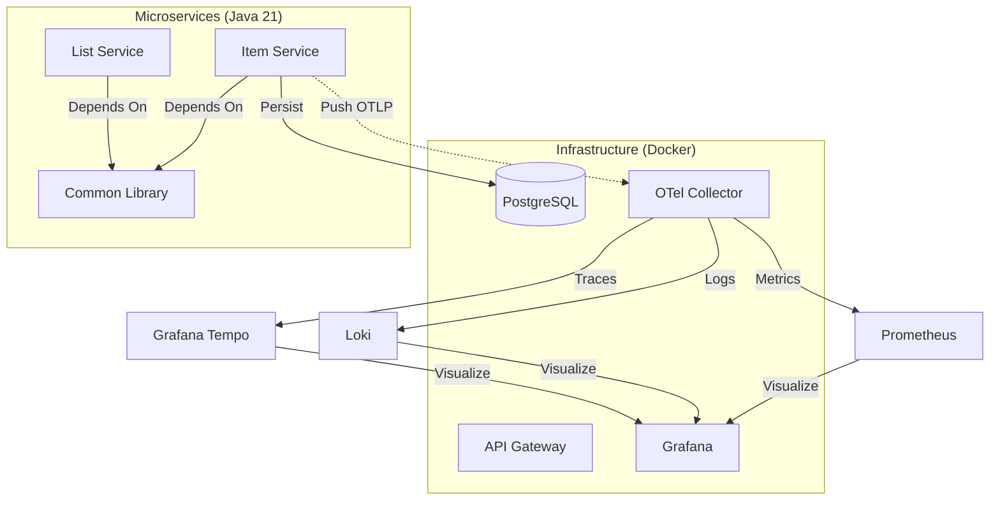

# 🏠 Home Inventory System (家庭庫存管理系統)


這是一個採用 **現代化微服務架構** 建構的家庭庫存管理系統。專案旨在演示企業級的軟體工程實踐，包含 **分散式鏈路追蹤 (Distributed Tracing)**、**集中式日誌 (Centralized Logging)** 以及 **Shared Library 模組化設計**。

## 🌟 核心架構 (Architecture)

本系統採用 **Database-per-service** 模式，並透過 **OpenTelemetry Collector** 實現全端可觀測性。



## 🛠️ 技術堆疊 (Tech Stack)

### Backend & Core

* **Language:** Java 21 (LTS)
* **Framework:** Spring Boot 4.0.1
* **Build Tool:** Gradle (Kotlin DSL) with Multi-Module support
* **API Docs:** Swagger / OpenAPI 3 (SpringDoc)
* **Audit Log:** Zalando Logbook (Request/Response logging)

### Observability (The "LGTM" Stack)

* **Tracer:** OpenTelemetry (Micrometer Tracing)
* **Metrics:** Prometheus
* **Logs:** Loki (via OTel Collector)
* **Visualization:** Grafana
* **Tracing:** Grafana Tempo

### Infrastructure

* **Containerization:** Docker & Docker Compose
* **Database:** PostgreSQL 15
* **Message Queue:** RabbitMQ (Planned)

## 📂 專案結構 (Project Structure)

```text
home-inventory-sys/
├── backend-java/
│   ├── common-library/       # [核心] 共用依賴、Log設定、Global Exception Handler
│   ├── item-service/         # [業務] 物品管理微服務 (Port: 1031)
│   ├── list-service/         # [業務] 購物清單微服務 (Planned)
│   ├── build.gradle.kts      # Root Gradle 設定
│   └── settings.gradle.kts   # 模組定義
├── infra/                    # 基礎建設設定 (Prometheus, Loki, OTel config)
└── docker-compose.yml        # 一鍵啟動環境

```

## 🚀 快速開始 (Quick Start)

### 1. 啟動基礎設施

確保你已安裝 Docker 與 Docker Compose。

```bash
docker compose up -d

```

這將會啟動 Postgres, OTel Collector, Grafana, Loki, Tempo, Prometheus 等服務。

### 2. 啟動微服務 (Development Mode)

建議使用 IntelliJ IDEA 或 Eclipse 開啟 `backend-java` 資料夾，直接執行 `ItemServiceApplication`。

* **Item Service Port:** `1031`

### 3. 驗證與測試

* **Swagger UI (API 文件):** [http://localhost:1031/swagger-ui.html](https://www.google.com/search?q=http://localhost:1031/swagger-ui.html)
* **Grafana (監控儀表板):** [http://localhost:3000](https://www.google.com/search?q=http://localhost:3000) (帳密: admin/admin)
* *Explore -> Loki:* 查看帶有 TraceID 的 Log
* *Explore -> Tempo:* 查看 API 呼叫鏈路


## 📝 開發指引 (Developer Guide)

### 加入新服務

本專案採用 **Shared Library** 策略。若要新增微服務，請在 `build.gradle.kts` 中引用 `common-library`：

```kotlin
dependencies {
    implementation(project(":common-library"))
    // ... 其他依賴
}

```

這將自動為新服務啟用 OTel 追蹤、Swagger 文件與標準化日誌。

### 可觀測性設定

* **Logs:** 所有 Log (包含 Request/Response) 會自動推送到 Loki。
* **Traces:** 透過 `OTel Collector` 統一收集，無需在個別服務設定 Exporter。

## 📜 License

MIT License
